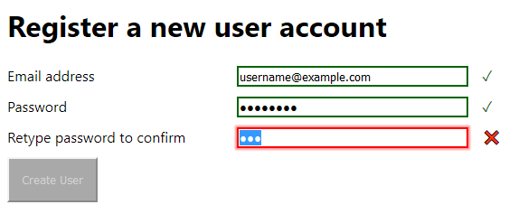

# Simple ASP.NET MVC Example: Adding a User to a Database

[](https://ci.appveyor.com/project/alistairmgreen/mvcadduserexample)

This is a simple demonstration application using Microsoft ASP.NET MVC 5 in conjunction with SQL Server.
It displays a form which allows users to be added to a database:



The form is validated on the client side using the built-in capabilities of HTML 5. It is then checked
again on the server side to ensure that an email address has been entered, the password is at least
8 characters long and both copies of the password match.

An error message will be displayed if these criteria are not met, or if an attempt is made to create two users with the same password.

## Prerequisites

* Visual Studio 2017
* SQL Server Express or higher (tested with 2016 Express LocalDB, but should work with older versions).
* **Important:** The [Visual C++ Redistributable for Visual Studio 2015](https://www.microsoft.com/en-us/download/details.aspx?id=48145)
must be installed. This is needed because password hashing is performed using [libsodium-net](https://github.com/adamcaudill/libsodium-net),
which is a wrapper around a cryptography library written in C.

If you have [Chocolatey](https://chocolatey.org) installed then you can obtain the redistributable automatically via:
```
choco install vcredist2015 -y
```

Alternatively, download the installer from the link above and run it manually.

### Setting up the database

1. Run the `CreateDatabase.sql` script against an instance of SQL Server. This will create a database called 
   `MvcAddUserExample` with a single table, `dbo.Users`.

2. If necessary, edit the connection string in `MvcAddUserExample\Web.config` to point at your SQL Server instance.
The default configuration is for SQL Server LocalDB:
```xml
 <connectionStrings>
    <add name="UserDatabase" providerName="System.Data.SqlClient" connectionString="Data Source=(LocalDB)\MSSQLLocalDb;Initial Catalog=MvcAddUserExample;Integrated Security=True"/>
  </connectionStrings>
```

## Running the application

After completing the steps above, open `MvcAddUserExample.sln` in Visual Studio. Go to the Debug menu and choose either
"Start debugging" or "Start without debugging".

## Implementation notes

### Security considerations

* The form is protected against cross site request forgery using the built in anti-forgery token features of ASP.NET MVC.
* Paramaterized SQL queries are used to guard against SQL injection attacks.
* Passwords are stored only in salted and hashed form. The hashing algorithm is [Scrypt](https://en.wikipedia.org/wiki/Scrypt), which is a memory-hard key derivation function that is difficult to attack by brute force.
* A unique salt value is used for each password, so it is not possible to tell by inspection of the database whether two users have the same password. (Note that a single field holds both the salt value and the output of the hash.)
* *Caveat:* The form really needs to be served over HTTPS, but due to time constraints this feature is not implemented.

### Testing

Unit tests are implemented using [NUnit](https://nunit.org/) and [Fluent Assertions](https://fluentassertions.com/).

### Dependency injection

The dependency injection framework used is [StructureMap](https://structuremap.github.io/). Convention-based mapping is used to find concrete classes corresponding to the various interfaces: `IFoo` is expected to have a concrete implementation called `Foo`.

### Project structure

The `MvcAddUserExample` project is the presentation layer and main executable.

The `MvcAddUserExample.Core` project contains the domain models, exception classes and interfaces for injected services. This project is referenced by all other tiers of the application, but does not itself contain any references to the other tiers.

`MvcAddUserExample.Services` holds the business logic, and `MvcAddUserExample.Providers` is the persistence layer that communicates with SQL Server.

Note that the persistence layer does not employ a traditional repository pattern. Instead, it takes the approach of having a "provider" class (with interface) for each kind of operation that is needed. In a more complex application, this makes it easier to perform operations that require joins across multiple tables.